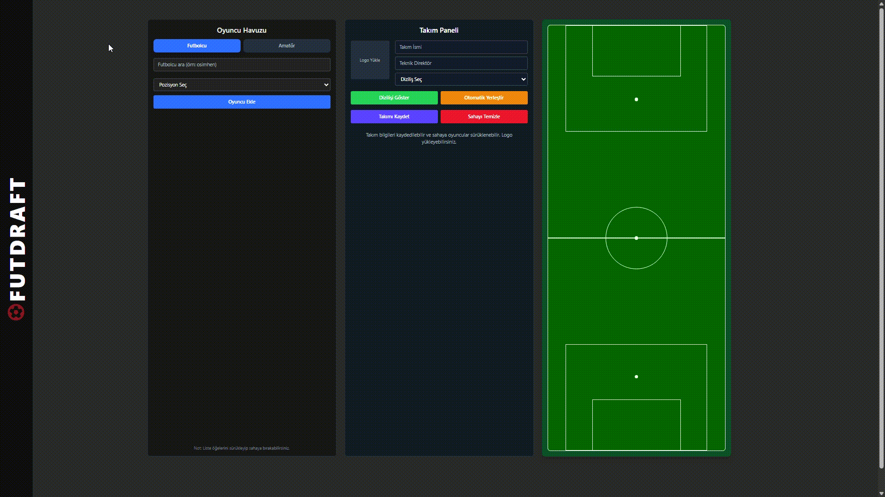
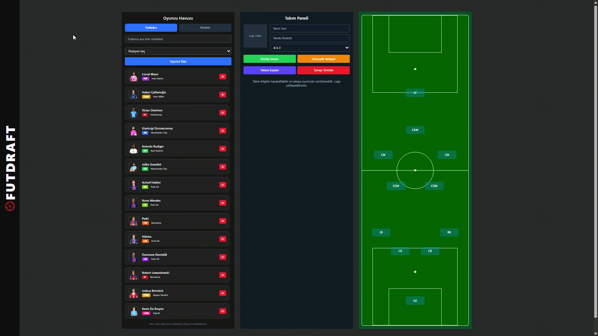

# 📘 FutDraft App – Demo & Component Documentation

React + Vite ile geliştirilmiş, hem **profesyonel futbolcuların** hem de **halı saha oyuncularının** kendi kadrolarını oluşturabileceği modern, eğlenceli ve interaktif bir futbol kadro oluşturma platformu.

Bu demo deposu; uygulamanın yapısını, bileşenlerini ve gelecek planlarını göstermeyi amaçlar.  
Gerçek uygulama kodları güvenlik nedeniyle **private** bir repoda tutulmaktadır.

---

# ⚽ FutDraft App – Futbol Severler İçin Kadro Oluşturma Platformu

FutDraft App, kullanıcıların hem profesyonel futbolculardan hem de **arkadaş gruplarından veya halı saha oyuncularından** kendi kadrolarını kurabildiği modern bir diziliş ve takım oluşturma uygulamasıdır.

Kullanıcılar:
- Oyuncu ekleyebilir  
- Pozisyona göre saha yerleşimini düzenleyebilir  
- Farklı formasyonlar seçebilir  
- Sürükle–bırak (Drag & Drop) ile kolayca takım dizilimi yapabilir  

---

# 🎯 Amaç

Bu platformun amacı, futbolu yalnızca profesyonel düzeyde değil;  
**halı saha takımları**, **arkadaş grupları**, **amatör lig oyuncuları** ve  
kendi takımını kurmak isteyen herkese yönelik modern, kolay kullanımlı ve eğlenceli bir kadro oluşturma deneyimi sunmaktır.

---

# 🧩 Component Yapısı

Aşağıda FutDraft App içinde kullanılan temel React component’lerinin işleyişi açıklanmaktadır.  
(Kodlar güvenlik nedeniyle **paylaşılmamıştır**.)

---

## 📌 `PlayerPool.jsx`
**Amaç:**  
Kullanıcının yeni oyuncu oluşturup oyuncu havuzuna ekleyebildiği panel.

**Özellikler:**
- İsim & pozisyon girişi  
- Form doğrulama  
- Yeni oyuncuyu state’e ekleme  
- Oyuncu havuzu gösterimi  

**Props:**
- `players`  
- `setPlayers`  

---

## 📌 `FieldPanel.jsx`
**Amaç:**  
Oyuncuların drag & drop ile sahaya yerleştirildiği ana alan.

**Özellikler:**
- Sürükle–bırak sistemi  
- Pozisyon uyumluluğu kontrolü  
- Sahadaki oyuncuların gösterimi  
- Pozisyon mapping  

**Props:**
- `playersOnField`  
- `setPlayersOnField`  
- `formationPositions`  

---

## 📌 `PlayerCard.jsx`
**Amaç:**  
Tek bir oyuncuyu kart olarak temsil eder.

**Özellikler:**
- Oyuncu fotoğrafı  
- Pozisyon badge’i  
- Drag event’leri  

**Props:**
- `player`  
- `draggable`  

---

## 📌 `FormationSelector.jsx`
**Amaç:**  
4-3-3, 4-4-2 gibi formasyonların seçildiği panel.

**Özellikler:**
- Formasyon state yönetimi  
- `formationPositions` güncellemesi  
- Sahada otomatik düzenleme  

**Props:**
- `formation`  
- `setFormation`  

---

## 📌 `utils/footballUtils.js`
**Amaç:**  
Pozisyon isimleri, kısaltmalar, renk kodları ve formasyon koordinatlarını içerir.

**İçerik:**
- `positionMap`  
- Formasyon pozisyon verileri  
- Pozisyon doğrulama fonksiyonları  

---

## 📌 `App.jsx`
**Amaç:**  
Tüm component’leri yöneten ana uygulama bileşeni.

**İşleyiş:**
- Oyuncu listesi state  
- Saha oyuncuları state  
- Formasyon state  
- Component’ler arası veri yönetimi  

---
# 🌐 Kullanılan API: TheSportsDB

FutDraft App içinde profesyonel futbolcuların bilgilerini dinamik olarak almak için  
**TheSportsDB** isimli açık futbol veri API’si kullanılmıştır.

**🔗 API:** https://www.thesportsdb.com  

Bu API sayesinde uygulama şu verileri çekebilmektedir:
- Futbolcu arama (isim ile)
- Oyuncu fotoğrafı
- Mevcut takımı
- Yaş, pozisyon ve ülke bilgileri
- Oyuncu ID’leri (ileri geliştirmeler için)

**Kullanım Mantığı:**
Kullanıcı arama kutusuna bir futbolcu ismi yazdığında (ör. *“Messi”*),  
TheSportsDB’den gelen sonuçlar listelenir ve kullanıcı buradan istediği oyuncuyu seçebilir.

API isteği örneği:

```js
fetch(`https://www.thesportsdb.com/api/v1/json/3/searchplayers.php?p=${playerName}`)
  .then(res => res.json())
  .then(data => console.log(data));
```
---
# 📸 Uygulama Fotografları

Aşağıdaki görseller, FutDraft App'in temel akışlarını ve kullanıcı deneyimini kısa şekilde göstermektedir.


## 🔢 Formasyon Seçimi  
**Açıklama:**  
4-3-3, 4-4-2, 3-5-2 gibi formasyonlar seçilerek sahadaki yerleşim otomatik güncelleniyor.



---

## 🎯 Oyuncu Seçimi  
**Açıklama:**  
Oyuncu havuzundan istenilen oyuncu seçilip detaylarına bakılabiliyor ve sahaya eklenebiliyor.


---
## 🏟️ Sahaya Oyuncu Eklenmesi (Drag & Drop)  
**Açıklama:**  
Oyuncular sürükle–bırak yöntemiyle sahadaki uygun pozisyonlara yerleştiriliyor.



---
## 🧍‍♂️ Amatör & Halı Saha Oyuncusu Ekleme  
**Açıklama:**  
Kullanıcı, amatör veya halı saha oyuncularını isim + pozisyon girerek oyuncu havuzuna ekleyebiliyor.


---
# 🚀 Yakında Gelecek Özellikler

## 📌 1. Kadro Paylaşma  
Kullanıcılar oluşturdukları kadroyu:  
- Link aracılığıyla paylaşabilecek  
- Takım arkadaşlarına gönderebilecek  

---

## 📌 2. Oyuncu Özellik Kartları  
Her oyuncu için özel bilgiler eklenebilecek:  
- Güçlü yönler  
- Zayıf yönler  
- Hız, pas, şut, kondisyon gibi mini rating alanları  

---

## 📌 3. Amatör Oyuncular İçin Kart Fotoğrafı Ekleme  
Halı saha oyuncuları ve amatör futbolcular:  
- Kendi fotoğraflarını ekleyebilecek  
- Gerçekçi oyuncu kartı görünümü oluşturabilecek  

---

# 📝 Not  
Bu repo, FutDraft App uygulamasının **demo ve tanıtım** versiyonudur.  
Gerçek kaynak kodları güvenlik nedeniyle **private repoda** tutulmaktadır.

📢 **Canlı sürüm** yayınlandığında, bu sayfada veya ilgili canlı repoda bağlantı paylaşılacaktır.  
Her türlü geri bildirim ve iş birliği teklifleri için [emiradymn.com.tr](http://emiradymn.com.tr) adresinden iletişime geçebilirsiniz. 
